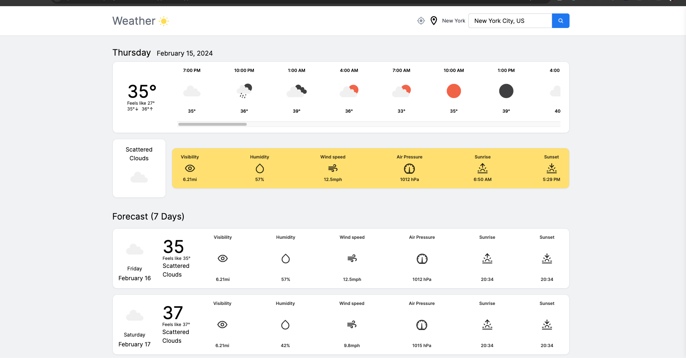
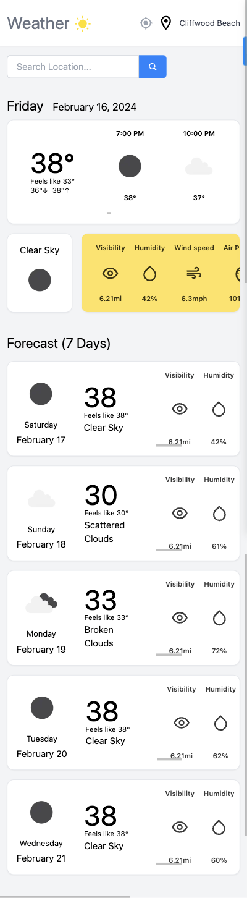

# Weather App

A responsive weather application built with Next.js, TypeScript, React Query, Jotai, Tailwind CSS, and the OpenWeather API.

### [Live Demo](https://open-weather-api-dynamic-weather-app.vercel.app/)

[Watch the short demo on Loom](https://www.loom.com/share/48e46026bf634bb2b694ece607ab9f2c?sid=8297c142-d45a-4580-b46a-e0481901656b)

## What it does

- Search current weather and forecasts by city
- Use browser geolocation for local weather
- Handle loading states with skeleton UI
- Cache and synchronize API data with React Query
- Manage lightweight client state with Jotai
- Adapt across desktop and mobile layouts

## Stack

- Next.js
- React
- TypeScript
- Tailwind CSS
- React Query
- Jotai
- OpenWeather API
- Vercel

## Screenshots

## Notes

I originally built this project while sharpening my Next.js, TypeScript, and client-side data-fetching skills. I have kept it public because it is a compact example of API integration, state management, responsive UI, and deployment.
